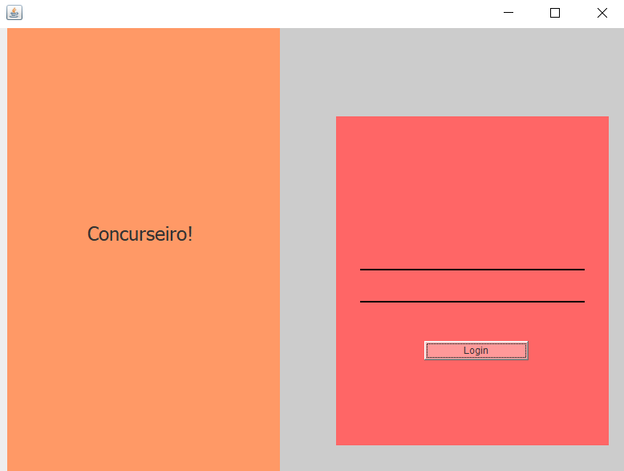
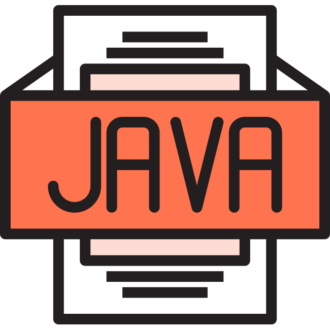
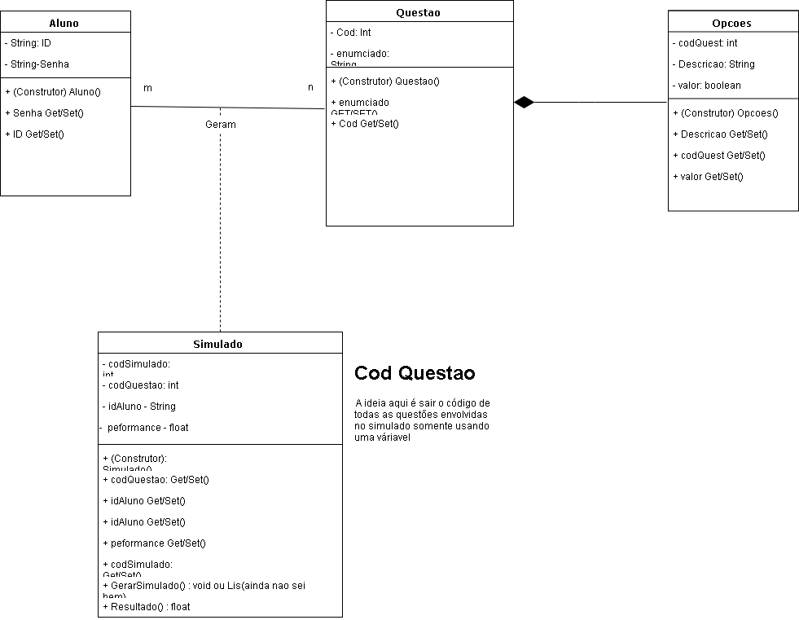

<p align="center">
  <a href="http://ant.design">
    
  </a>
</p>

<h1 align="center"> Deskotp Application, A Concurseiro System to students!</h1>


## Description 

This project illustrates an example of a simple application in pure java using sqlite and hibernate for learning.
The project is still under development. there were some obstacles but his development will return soon.

## Demostration


## SKILLS




## What is a desktop system ?

Secund [vibe](https://vibetecnologia.com/sistemas-desktop/#:~:text=Sistemas%20desktop%20s%C3%A3o%2C%20normalmente%2C%20sistemas,podem%20ser%20instalados%20no%20computador.&text=Os%20jogos%20e%20as%20ferramentas,web%20para%20os%20mesmos%20fins.) "Desktop systems are typically standalone systems that can be installed on the computer. When you download a computer program that runs on your machine, installing software such as Microsoft Word or Adobe Acrobat PDF Reader, we are talking about installing a desktop system."
For more information read the [java documentation](https://docs.oracle.com/en/java/)

## Training Scope

The objective of this project is to demonstrate in a practical way how to develop a desktop system, such as:

- Create a project
- Create a page
- Create a service
- Versionalize.
- Persist data using the SQlite.
- Gradually start using hibernate.

## Class Diagram 

Using UML for the development of your diagram.



## Starting

To run the project, you will need to install the following programs:

- [JDK: a toolkit, necessary to carry out the project](https://www.oracle.com/br/java/technologies/javase-downloads.html)
- [SQlite: Required to create the database](https://www.sqlite.org/download.html)
- [Netbeans: For project development](https://netbeans.org/downloads/8.2/rc/)

## ⌨️ Development

Use Gitpod, a free online dev environment for GitHub.

[](https://gitpod.io/#https://github.com/Figur8/ProjetoCrossOver.git)
Or use code locally using:
```
cd "Directory of your preference"
git clone https://github.com/Figur8/ProjetoCrossOver.git
```

### Construction

To execute a java project, it is quite simple.
Here is a tutorial for you to understand how to work and apply it in a practical way. Follow the link - [Java tutorial](https://netbeans.org/kb/docs/java/quickstart_pt_BR.html)

## Features

The project can be used as a template to start the development of a java project using hibernate and sqlite. It also demonstrates in a practical way how to create a CRUD with sqlite in netbeans.

## Configuration

To execute the project, it is necessary to use Netbeans or an IDE of your choice, in order to identify the necessary dependencies to be executed in the repository. Once the project is imported, it will be possible to test its functionality in real time.

## Contributions

Contributions are always welcome! I hope that it will help someone!

## Additional Information

If you are interested in how to put the dark theme on netbeans, then I will be providing a tutorial on how to do it, stay tuned.